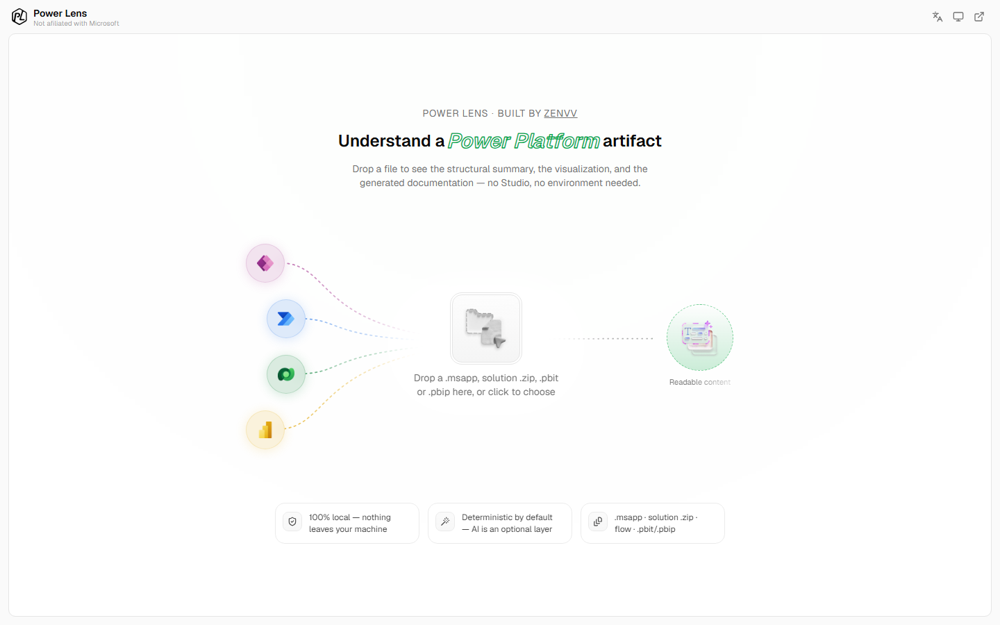
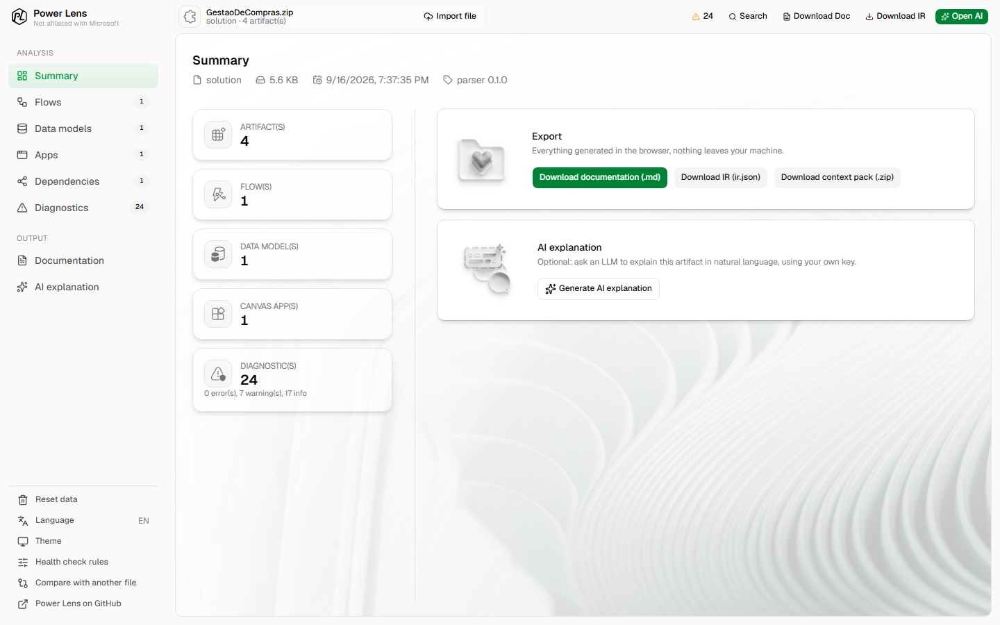
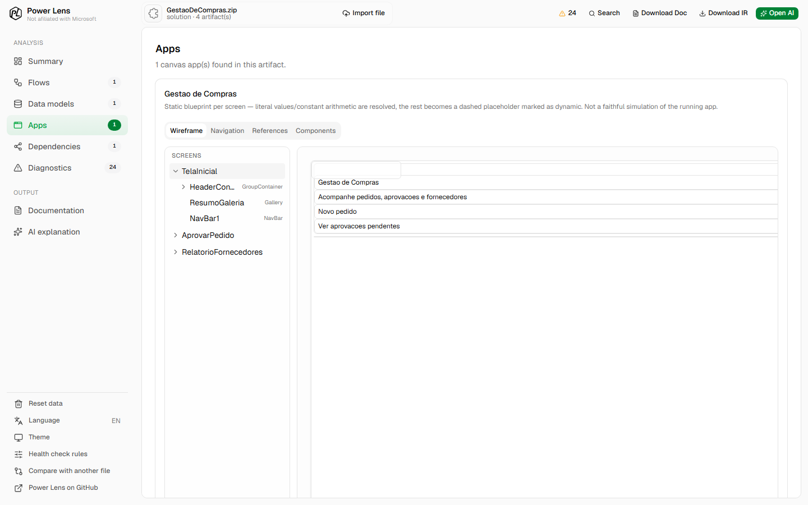
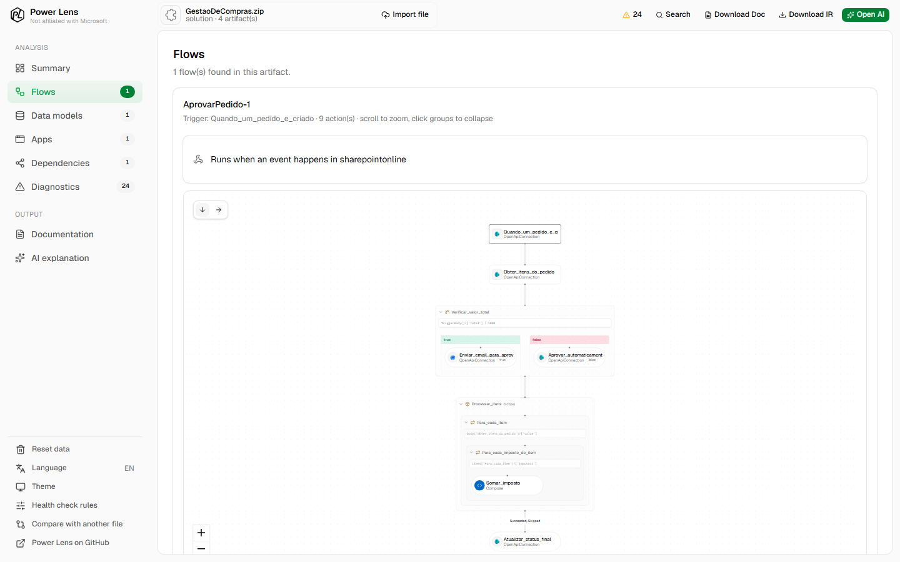
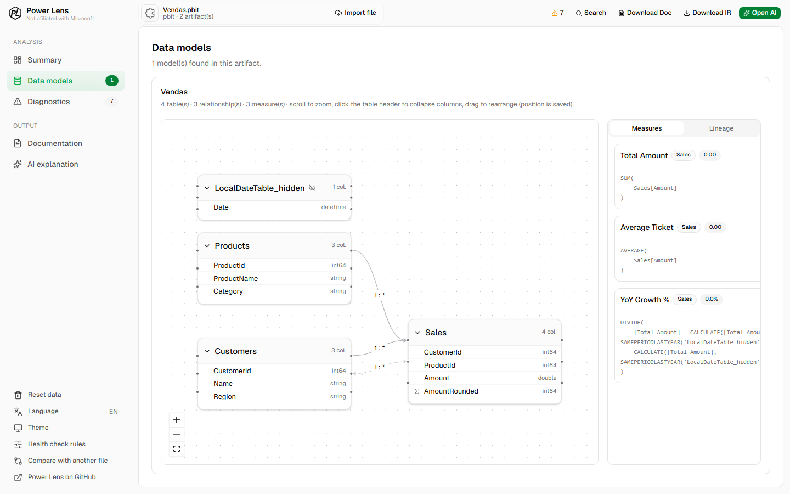
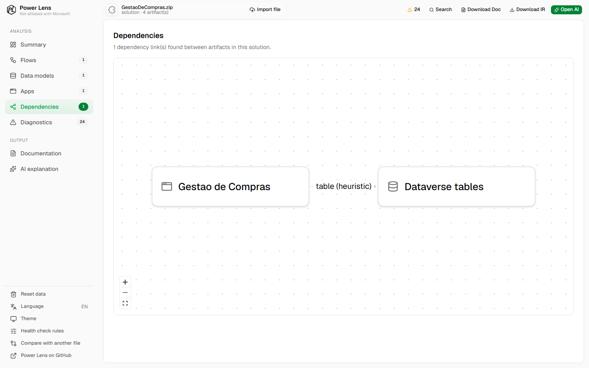
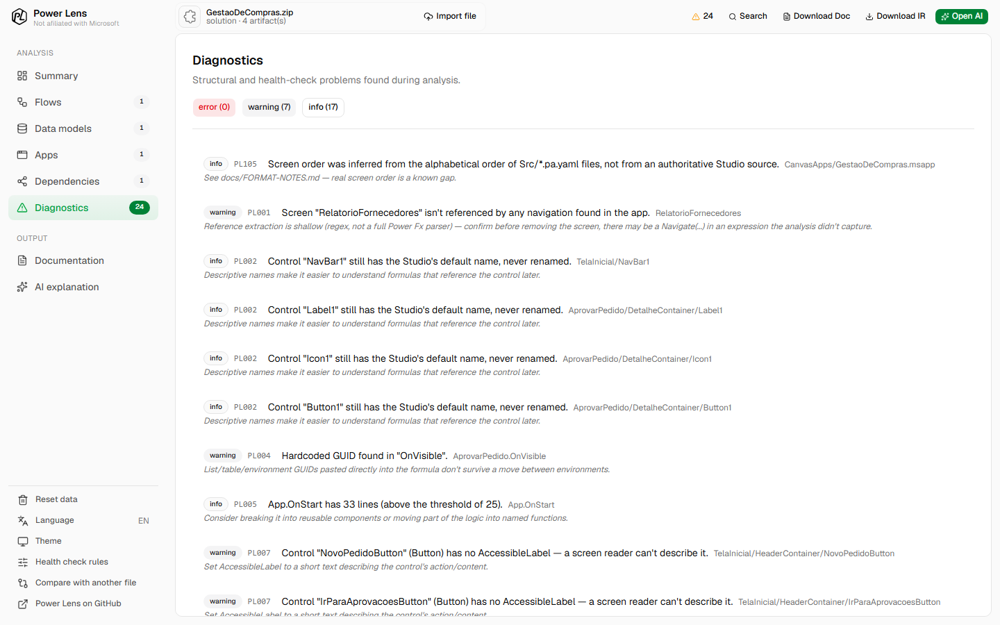
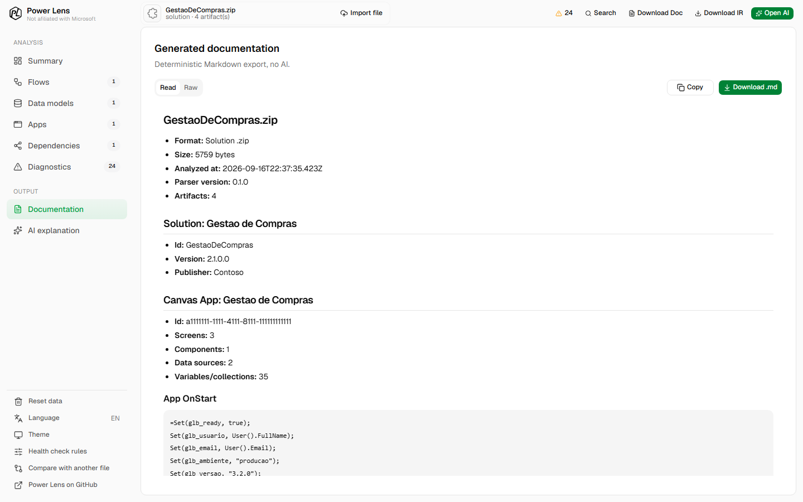

<div align="center">
  
</div>

<div align="center">

**Leia, entenda e documente artefatos da Power Platform — sem Studio, sem ambiente, sem subir nada pra lugar nenhum.**

[](https://github.com/zenvv/power-lens/actions/workflows/ci.yml)

</div>

---

## O que é

Power Lens é uma ferramenta open source e **100% client-side** para ler, entender e documentar
artefatos exportados da Power Platform: apps Canvas (`.msapp`), solutions do Dataverse (`.zip`),
fluxos do Power Automate (definição de fluxo) e relatórios/modelos do Power BI
(`.pbit`/`.pbip`/`.pbix`).

Você arrasta o arquivo pro navegador e recebe, na hora: um resumo estrutural, uma visualização
adequada ao tipo de artefato (wireframe pra apps, DAG pra fluxos, diagrama entidade-relacionamento
pra modelos de dados), health checks automáticos e documentação exportável em Markdown — tudo
rodando localmente. Nenhum arquivo sai da sua máquina.

## O problema

Entender um app, fluxo ou modelo de dados da Power Platform que **você não construiu** normalmente
significa abrir o Power Apps Studio, o Power Automate ou o Power BI Desktop, esperar carregar,
navegar tela por tela — e ainda assim não sair de lá com nada que possa ser lido, revisado em PR ou
compartilhado com quem não tem acesso ao ambiente. Documentação de app/fluxo/modelo Power Platform
quase sempre significa alguém abrindo o Studio e digitando um resumo manual, que fica desatualizado
na primeira mudança.

Power Lens existe pra tirar o Studio do meio desse processo: qualquer pessoa (dev, analista,
auditor) consegue abrir o arquivo exportado e entender sua estrutura, suas dependências e seus
problemas, sem precisar de licença, ambiente ou acesso a nada além do arquivo em si.

**O que Power Lens não é** (por decisão explícita, não por limitação): não é um builder nem um
editor — nunca escreve de volta no arquivo original; não é um emulador de app — não avalia Power Fx
com dados reais; não é substituto do App Checker/Solution Checker da Microsoft; não tem backend,
conta de usuário ou telemetria.

## Features

- **Multi-formato** — detecta e faz parsing de `.msapp`, solution `.zip` (Dataverse), definição de
  fluxo do Power Automate e `.pbit`/`.pbip`/`.pbix` do Power BI, tudo por magic bytes + estrutura
  interna do zip, sem depender da extensão do arquivo.
- **Wireframe de app** — reconstrói a árvore de telas e controles de um Canvas App num wireframe
  navegável, com mapa de navegação entre telas, inventário de componentes e painel de referências de
  controle.
- **Diagrama de fluxo** — desenha o DAG de um Cloud Flow com trigger, ramificações (`If`/`Switch`),
  loops (`Foreach`) e escopos, com inspeção de cada ação e dos conectores usados.
- **Modelo de dados (MER)** — visualiza tabelas, colunas, relacionamentos (incluindo cardinalidade e
  relacionamentos inativos), medidas DAX e um painel de lineage que mostra que colunas/medidas estão
  de fato em uso nos visuais de um relatório.
- **Grafo de dependências** — cruza os artefatos de uma solution (apps, fluxos, tabelas do Dataverse)
  e traça os vínculos entre eles (fonte de dados de um app apontando pra uma tabela, fluxo chamando
  outro fluxo).
- **15 regras de health check** — PL001–PL015, funções puras sobre o IR: tela órfã, controle com
  nome default, GUID hardcoded em fórmula, `OnStart` longo demais, fórmula duplicada, função não
  delegável, conector premium, relacionamento inativo ou com shape arriscado (many-to-many,
  bidirecional), `Foreach` aninhado, coluna/medida sem uso, contraste de cor baixo, entre outras —
  configuráveis (liga/desliga e limiares) sem precisar editar código.
- **Documentação determinística** — exporta Markdown, o IR completo (`.json`) e um pacote de
  contexto pronto pra colar num LLM, sem nenhuma chamada de rede.
- **Explicação por IA (opcional, BYOK)** — pede pra um LLM à sua escolha explicar o artefato em
  linguagem natural; a chamada sai direto do seu navegador pro provedor, com sua própria chave — a
  Power Lens nunca vê o conteúdo nem a chave.
- **Busca global (Cmd/Ctrl+K)** — encontra qualquer tela, controle, ação de fluxo, tabela ou medida
  no documento carregado e pula direto pra ela.
- **Comparação entre arquivos** — faz diff estrutural entre duas versões do mesmo artefato (telas,
  controles, ações de fluxo, tabelas, relacionamentos) pra ver exatamente o que mudou.
- **i18n** — interface em inglês, português e espanhol.
- **Degradação honesta** — quando algo não pode ser extraído, a UI diz o que falta e por quê, em vez
  de mostrar uma tela vazia.

## Screenshots

<table>
<tr>
<td width="50%"><br/><sub><b>Início</b> — arraste um arquivo, nada sai da sua máquina.</sub></td>
<td width="50%"><br/><sub><b>Resumo</b> — contagem de artefatos, diagnósticos e exportação.</sub></td>
</tr>
<tr>
<td width="50%"><br/><sub><b>App (Canvas)</b> — wireframe navegável por tela e controle.</sub></td>
<td width="50%"><br/><sub><b>Fluxo</b> — DAG com branches, loops e escopos.</sub></td>
</tr>
<tr>
<td width="50%"><br/><sub><b>Power BI</b> — MER com relacionamentos, medidas e lineage.</sub></td>
<td width="50%"><br/><sub><b>Relacionamentos</b> — grafo de dependências entre artefatos de uma solution.</sub></td>
</tr>
<tr>
<td width="50%"><br/><sub><b>Diagnósticos</b> — health checks com severidade, caminho e hint.</sub></td>
<td width="50%"><br/><sub><b>Documentação</b> — Markdown determinístico, sem IA.</sub></td>
</tr>
</table>

Mais telas (busca global, painel de lineage, mapa de navegação, estado da IA opcional) em
[`.github/readme/screenshots/`](.github/readme/screenshots/).

> Todos os screenshots usam dados fictícios gerados só pra demonstração — nenhum artefato real.

## Como funciona

```
arquivo bruto
     │
     ▼
┌──────────────┐   detecta formato por magic bytes + estrutura interna do zip
│   detector   │
└──────┬───────┘
       ▼
┌──────────────┐   um parser por formato — única camada que conhece o arquivo real
│   parsers    │   msapp · solution · flow · pbit/pbip · pbix (parcial)
└──────┬───────┘
       ▼
┌══════════════┐
║      IR      ║   JSON canônico, validado por schema (zod). O produto de verdade.
└══════┬═══════┘
       ▼
┌──────────────────────────────────────────────────────────┐
│ renderers                                                 │
│  resumo · MER · DAG de fluxo · doc export · health check · │
│  wireframe · busca · diff · pacote de contexto pra IA      │
└──────────────────────────────────────────────────────────┘
```

Regra de arquitetura: **nenhum renderer abre um zip ou lê YAML.** Tudo consome o IR
(`PowerLensDocument`). Se uma view precisa de um dado que não está no IR, a resposta é estender o
IR — nunca fazer o renderer voltar a ler o arquivo bruto. Falha de parsing nunca lança exceção: vira
um `Diagnostic` no próprio documento.

Detalhes completos da arquitetura e do formato de cada arquivo em [`docs/SPEC.md`](docs/SPEC.md) e
[`docs/FORMAT-NOTES.md`](docs/FORMAT-NOTES.md).

## Stack

- **Monorepo pnpm workspaces**: [`packages/core`](packages/core) (parsers, IR, regras de health
  check — zero DOM, roda em Node e no browser) + [`apps/web`](apps/web) (viewer: Vite + React +
  TypeScript).
- **Parsing**: [`fflate`](https://github.com/101arrowz/fflate) pra zip, [`yaml`](https://eemeli.org/yaml/)
  (eemeli) pro Power Fx YAML dos Canvas Apps.
- **IR**: [`zod`](https://zod.dev/) como fonte de verdade do schema, com tipos TypeScript derivados
  via `z.infer`.
- **UI**: React + Tailwind CSS v4 (config CSS-first) + [shadcn/ui](https://ui.shadcn.com/) (tema
  neutral, dark mode), [`@xyflow/react`](https://reactflow.dev/) pros diagramas (fluxo, MER, grafo
  de dependências, mapa de navegação), [`elkjs`](https://github.com/kieler/elkjs) pro layout
  automático desses grafos.
- **Testes**: [Vitest](https://vitest.dev/).

## Rodando localmente

Requer Node ≥ 22.13 (exigido pelo próprio `pnpm@11`) e [pnpm](https://pnpm.io/).

```bash
pnpm install

pnpm dev         # sobe apps/web em modo dev (Vite)
pnpm typecheck   # tsc --noEmit em todos os workspaces
pnpm test        # vitest em todos os workspaces
pnpm build       # build de produção
```

O app é **desktop only** por decisão de produto — em telas pequenas ele mostra uma tela informando
que é preciso abrir num desktop, em vez de tentar adaptar o layout.

## Estrutura do repositório

```
packages/core/    parsers, IR (schema + validação), regras de health check, i18n — sem DOM
apps/web/         viewer (Vite + React), toda a UI
fixtures/         fixtures sintéticas usadas nos testes de parser (nunca dados reais)
docs/             spec, notas empíricas de formato e changelog por incremento
```

`fixtures/real/` e `reference/` (material de um projeto anterior, só leitura) nunca são commitados
— ver `.gitignore`.

## Princípios de projeto

| Princípio | Consequência prática |
|---|---|
| **Client-side only** | Todo parsing acontece no browser. Nenhum arquivo sai da máquina. Deploy é estático. |
| **IR-first** | Nenhum renderer lê arquivo bruto. Tudo consome o IR. |
| **Determinístico por padrão** | Toda a extração e a documentação base funcionam sem IA. IA é camada opcional em cima. |
| **Degradação honesta** | Quando não dá para extrair algo, a UI diz o que falta e por quê, em vez de mostrar vazio. |
| **Offline-capable** | Depois de carregada, a app funciona sem rede (exceto a chamada opcional de LLM). |

## Contribuindo

O histórico completo de decisões — o quê, por quê e as respostas a perguntas feitas durante cada
incremento — fica em [`docs/changelog/`](docs/changelog/), um arquivo por feature. Antes de mexer em
parsing, veja [`docs/FORMAT-NOTES.md`](docs/FORMAT-NOTES.md) pro conhecimento empírico já levantado
sobre cada formato.

---

<div align="center">
<sub>Power Lens não é afiliado à Microsoft. "Power Apps", "Power Automate", "Power BI" e "Power Platform" são marcas da Microsoft Corporation.</sub>
</div>
